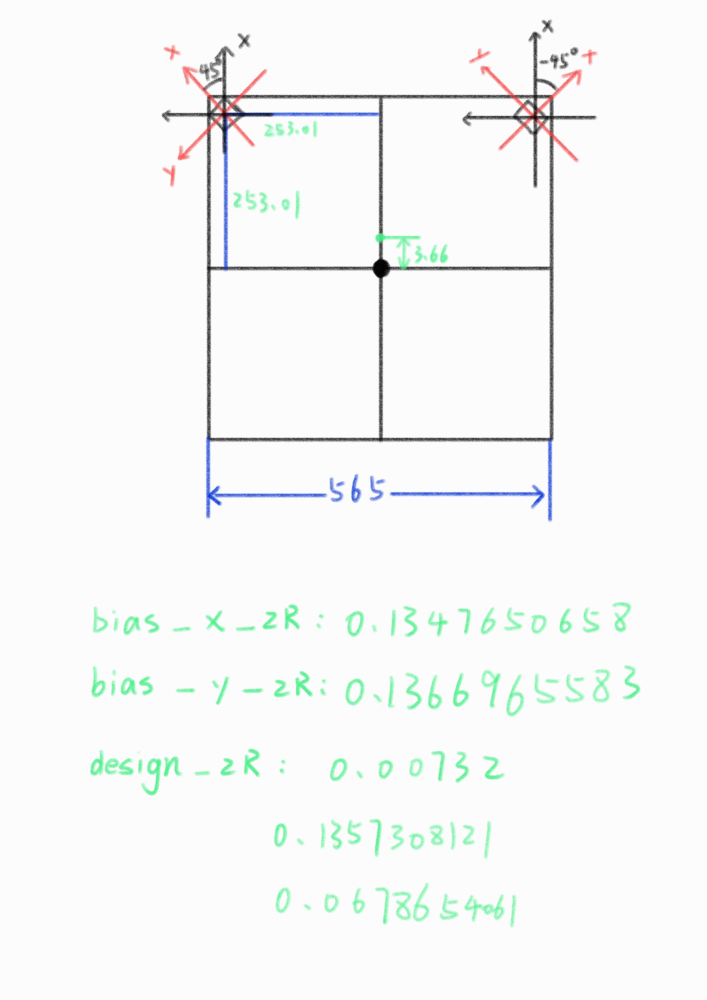
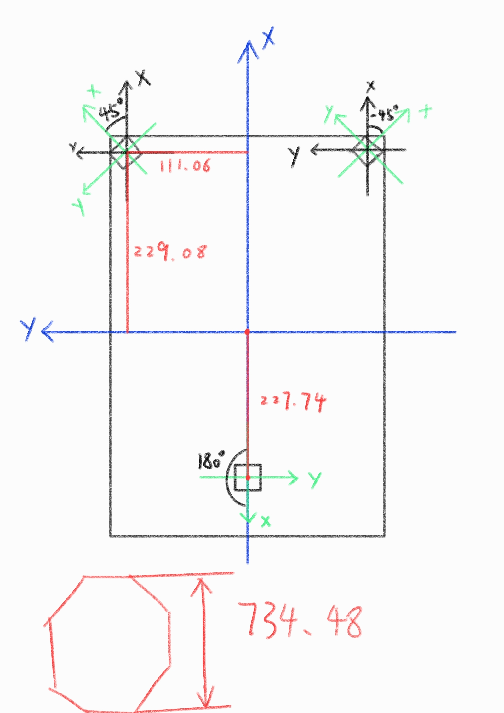

# World_Cloud_Converter

| cloud_converter.launch | 舵轮小底盘 | mid360处于车体中心               | cuda加速点云处理 |
| ---------------------- | ---------- | -------------------------------- | ---------------- |
| r1.launch              | 第二版 r1  | 车体前方两个pavo2                | 三线程处理点云   |
| r2.launch              | 第二版 r2  | 车体前方两个pavo2，车尾一个pavo2 | 四线程处理点云   |

